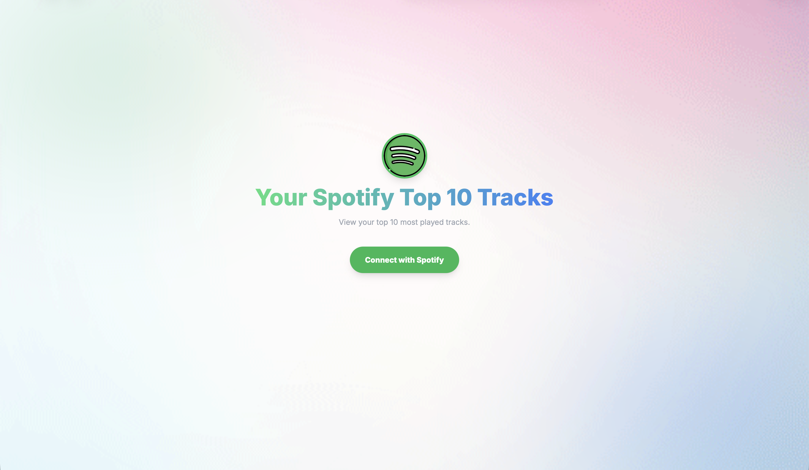

<div align="center">
  <h1>Spotify Top 10 Tracks Viewer 🎵</h1>
  <p>View your top 10 most played tracks on Spotify in a sleek, modern interface.</p>
  <p><strong>Live demo:</strong> https://spotify-top-10.onrender.com</p>
  <p>Built with <strong>Flask</strong>, <strong>React</strong>, and <strong>Tailwind CSS</strong>.</p>
</div>

## 🚀 Features

- **Secure OAuth 2.0 Login:** Authenticate safely using Spotify's official login flow.
- **Top Tracks Dashboard:** Automatically pulls your top 10 most played tracks.

## 📸 Screenshot



## 🛠️ Prerequisites

- Python 3.8+
- A [Spotify Developer](https://developer.spotify.com/dashboard) account.

## ⚙️ Installation & Setup

1. **Install the required packages:**

   ```bash
   pip install flask requests python-dotenv
   ```

   *(Or `pip install -r requirements.txt` if available)*
2. **Set up your Spotify Developer App:**

   - Go to the [Spotify Developer Dashboard](https://developer.spotify.com/dashboard).
   - Create a new application. This will generate your **Client ID** and **Client Secret**.
   - Open your app's settings and add `http://127.0.0.1:5000/callback` as a **Redirect URI**.
3. **Configure Environment Variables:**
   Create a `.env` file in the root of the project and add your details:

   ```env
   SPOTIFY_CLIENT_ID=your_client_id_here
   SPOTIFY_CLIENT_SECRET=your_client_secret_here
   FLASK_SECRET_KEY=add_a_random_secret_string_here
   ```

## 🏃‍♂️ How to Run

1. Start the Flask server:
   ```bash
   python app.py
   ```
2. Open your web browser and navigate to `http://127.0.0.1:5000`.
3. Click **Connect with Spotify**, authorize the app, and see your Top Tracks!

> **Note:** The Spotify API recently deprecated third-party access to the "Recommendations" endpoint. This app was modernized to pivot to the `user-top-read` scope, ensuring reliable, long-term fu[...]
